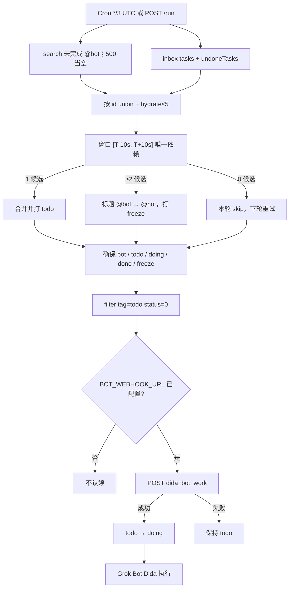

# dida-bot-merge

Cloudflare Worker（**方案2**）：把微信助手拆开的「依赖任务」与空正文 `@bot` 碎片按时间窗口合并，用嵌套标签 `bot` / `todo` / `doing` / `done` 认领待执行工作，矛盾碎片再打分类叶子 `freeze`，然后 webhook 唤醒配套 Grok Bot **Dida** 去执行。

仓库里不写真实线上地址。部署后把你自己的 Worker origin 填进 `PUBLIC_BASE_URL`，例如：

`https://dida-bot-merge.<account>.workers.dev`

使用 **dida365.com / api.dida365.com**（中国区滴答），不要用 ticktick.com，账号不互通。

## 产品（方案2）

Cron（UTC）`*/3 * * * *`（`wrangler.jsonc` → `triggers.crons`）每 3 分钟跑 **窗口合并 / `@not` 消歧 + 生命周期标签认领 + 按需 webhook**。选 `*/3`（约 **480** 次/天）是为了让每轮 merge 锁的 `put` + `delete` 落在 **Free** 套餐 KV 每日 write/delete 上限（各 **1000**）之内；原先 `*/2`（约 720 次/天）午间就会吃掉约一半配额，继续跑有 **429** 风险。Cloudflare cron 步长最小 1 分钟（`*/2.5` 非法）。改 cron 必须重新 `wrangler deploy`；已部署的触发器不会因为注释掉配置而消失，要停掉请设 `"crons": []`。

`POST /run` 与 Cron 调用同一函数 `runMergeAndNotify`。

### 信号拆分（微信拆条 / 已有任务下达）

Worker **不再**把「任意含 `@bot` 的非碎片」自动打成 `todo`。按信号分流：

| 任务 | Worker 行为 |
|------|-------------|
| 无 `@bot`、也无叶子 `todo` | **只入库**。Worker 忽略（可选：merge 锁、token 到期提醒） |
| 已有未完成任务：正文写/追加 `@bot` + 明确指令，并打叶子 `todo` | **认领路径**（日常「在已有任务里下达」）。**触发认领的是 `todo`**；正文 `@bot` 只是给 Grok Bot Dida 的指令锚点。只有正文 `@bot`、没有 `todo` **不会**自动派发 |
| 仅叶子 `todo`（例如微信创建时 `#todo`，正文清楚、不必含 `@bot`） | **认领路径**（不必合并） |
| 标题含 `@bot` 且 content 为空/null | **依赖碎片**（窗口合并）。**不是**「已有任务下达」这条路；必须找依赖，**不当**独立 auto-todo |
| 系统标签 `微信采集` | **来源信号**，只用于依赖匹配，不是用户派发标签 |
| 标题已被改写成含 `@not`，或带叶子 `freeze` | **永不自动合并** 该碎片（矛盾 / 待手工处理） |

长标题、空正文的 `@bot` 仍是碎片（方案2 定义），不会再走「无依赖也 auto-todo」的旧路径。

#### 已有任务里直接下达

不必走微信转发拆条。在**已有未完成任务**上：

1. 在 **content（正文）** 写入或追加 `@bot` + 明确指令；
2. 打上叶子标签 **`todo`**。

下一轮 Cron / `POST /run`：`filter tag=todo` 认领 → webhook 成功后再 `todo` → `doing`。

- 正文 `@bot` = 给配套 Grok Bot Dida 的**指令锚点**；**`todo` 才触发认领**。
- **只有正文 `@bot`、没有叶子 `todo`，不会自动派发。**
- **对比**：标题 `@bot` + 空正文 = 依赖碎片（窗口合并），不是这条路。
- 仍可用：微信新建时写 `#todo`；或只打叶子 `todo`、正文清楚、不必含 `@bot`。

### 要解决的问题

微信 → 滴答助手转发时，经常把**上下文 / 媒体**和结尾的 **`@bot` 指令**拆成两条收件箱任务。二者的 `createdTime` 往往差几秒，而不是截断到同一秒。Open API **不能**按 `createdTime` 做服务端过滤；配对在本地用**真实时间差**，窗口 **[T−10s, T+10s]**（T = 碎片 `createdTime`）。`−10s` 覆盖「先转发聊天、再 @bot」；`+10s` 覆盖晚到的图片。

旧版「把时间戳截到 `YYYY-MM-DDTHH:MM:SS` 再同秒配对」**不再是主算法**。

### 流程

```
Cron */3 UTC 或 POST /run
        │
        ▼
search 未完成字面 @bot（POST /task/search；若 500 则当空，不中断）
        +
GET /project/inbox/data（union tasks + undoneTasks）
        │
        ▼
按 id 去重 ── 仅补齐缺失的 createdTime / projectId（hydrate ≤5）
        │
        ▼
依赖碎片：标题含 @bot 且正文为空，且不含 @not；已有 freeze 的跳过自动合并
        候选依赖须同时满足：
          同一 inbox project、带标签 微信采集、
          不是另一条空正文 @bot 碎片、不含 @not、
          createdTime ∈ [T−10s, T+10s]
        候选数：
          1 → 合并（见下方）；结果打上叶子 todo
          0 → 本轮跳过（下一次 Cron 重试；无 eligibleAt KV）
          ≥2 → 标题 @bot → @not，并打叶子 freeze，不合并，交给用户
        │
        ▼
确保标签存在：父标签 bot，叶子 todo / doing / done / freeze（parent=bot）
        │
        ▼
POST /task/filter { status: [0], tag: ["todo"] }   ← 字段名是 tag 不是 tags
        跳过未合并碎片；不认领 doing / done
        │
        ▼
若配置了 BOT_WEBHOOK_URL：
          先 POST webhook（event: dida_bot_work，pending.lifecycle 为将要翻成的 doing）
          仅当 webhook 成功 → todo → doing
        若未配置 webhook URL：跳过认领（不改标签）
        │
        ▼
配套 Grok Bot Dida 按 pending.taskId 去滴答执行
（本 Worker 不执行任务内容，也不把任务标成 done）
```



**已完成任务不会被搜索**：`/task/search` 固定 `status: [0]`；入库后 `status !== 0` 的任务也会被丢掉。`POST /task/search` 在本账号上经常 500，Worker 会当成空结果并继续用 inbox union，**不会**为了补 content 去 hydrate 整个收件箱。

每轮全量重扫。没有 `eligibleAt` / `firstSeen` 检查点。幂等靠 `contentAlreadyHasPayload` 与已处理碎片 KV。

### 窗口合并

字面标记大小写敏感：`@bot`。`@not` 同样大小写敏感。

任务算 **依赖碎片** 当且仅当：标题含 `@bot`、content 为空或 null、标题不含 `@not`。已带叶子 `freeze` 的碎片仍算碎片（认领会跳过未合并碎片），但 **不会自动合并**。

候选依赖（须全部满足）：

- 与碎片同一 `projectId`（收件箱）
- 带系统标签 `微信采集`（来源信号，不是派发标签）
- 不是另一条空正文 `@bot` 碎片
- 标题不含 `@not`
- `createdTime` 落在碎片锚点 T 的 **[T−10s, T+10s]**（真实毫秒差，不是同秒字符串截断）

候选计数：

- **1**：合并到可执行任务。经典上下文（有实质正文）把碎片 payload 用 `---` 追加进依赖任务，然后删除碎片。媒体桩（如标题 `来自微信的图片`、正文空）把媒体/任务引用追加进碎片，**碎片留作主任务**，不删媒体任务。结果用 `withBotLifecycleTag` 打上叶子 `todo`（先去掉其它生命周期叶子）。
- **0**：本轮 skip，下次 Cron 再试。
- **≥2**：标题里的 `@bot` 换成 `@not`（其余保留），并打上叶子 `freeze`（保留 `微信采集` 等其它标签），不合并，交给用户处理。之后这条碎片不会再自动合并。

追加：`existing + "\n\n---\n\n" + payload`。payload 已在 content 里则不重写（幂等）。读回校验通过后再 `DELETE` 碎片（仅当碎片被合并走）。KV 记录已处理 fragment id（TTL ~60 天）。无半成品合并：append → verify → delete 作为同一预算单元。

每轮最多 `MAX_MERGE_OR_NOT = 5` 次合并 + `@not` 改写（合计）。

### 生命周期标签 `bot` / `todo` / `doing` / `done`

嵌套在父标签 **`bot`** 下的三片**认领**叶子。`freeze` 也挂在 `bot` 下，但是**分类叶子**，不是生命周期，见下一节。父标签只用于展示分组；**不要**用父标签 `bot` 做 filter 来覆盖子标签——Open API 按**叶子名**匹配，任务上的 `tags` 是 `["todo"]` 这种，不是 `bot/todo`。路径写法 `bot/todo` / `test/pending` **匹配不到**。父标签名单独出现在 `tags` 里才会被 `tag: ["bot"]` 命中。

叶子名在账号内全局唯一。若 `doing` 已经挂在别的父标签下（例如 `test`），Worker 不会再创建一份 `bot/doing`；filter 仍按叶子名 `doing` 匹配。方便时请在滴答 UI 里把这些叶子挂到 `bot` 下，便于分组展示。

| 叶子 | 含义 | 谁来写 |
|------|------|--------|
| `todo` | 可派发 | 合并成功后的可执行任务；或用户手工 `#todo` / 打叶子 `todo`（含「已有任务正文加 `@bot` 指令」）。**不再**对任意 `@bot` 标题或正文自动打标 |
| `doing` | 已认领 | Worker 在 **webhook 成功之后** 把 `todo` 改成 `doing` |
| `done` | 已完成 | 配套 Grok Bot Dida 在工作结束时写入；本 Worker 不写 `done` |

规则：

- 一个任务同一时间只有一片生命周期叶子。任务里有多段 `@bot` 也共用这一片状态。
- 认领时去掉 `todo`/`doing`/`done` 再加 `doing`，其它标签原样保留（含 `微信采集`、`freeze`）。`freeze` **不在** `BOT_LIFECYCLE_TAGS` / `withBotLifecycleTag` 里，免得 todo→doing 误删。
- 已是 `doing` / `done` 的任务本轮不会再认领、不会再 webhook。当前版本还没有 stuck-`doing` 超时回收。
- 派发查询只用 `POST /task/filter` body `{ status: [0], tag: ["todo"] }`。字段名必须是 **`tag`**；写成 `tags` 会被接口静默忽略。多个 tag 名可能是 OR，所以认领时只传 `["todo"]`。
- **Webhook 在前，doing 在后**：配置了 `BOT_WEBHOOK_URL` 时，必须 webhook 成功才翻标签；未配置则整段认领跳过（避免无执行方却把 `todo` 吃掉）。每轮最多 `MAX_CLAIM = 8`。

### 分类叶子 `freeze`（矛盾 / `@not`）

窗口内出现 **≥2** 条合法依赖时，Worker 把碎片标题 `@bot` 改成 `@not`，并打上挂在 `bot` 下的叶子 **`freeze`**。这是给滴答 UI **分类 / 筛选**用的，**不是**认领生命周期（不会走 todo→doing→done）。

在滴答里筛选：用叶子名 `freeze`（`tag: ["freeze"]`），不要写 `bot/freeze`。父标签 `bot` 只负责分组展示。

处理完矛盾、准备再让 Worker 试一次时：

1. 去掉叶子 `freeze`；
2. 把标题里的 `@not` 改回 `@bot`（或改成你确认的唯一指令）；
3. 必要时整理窗口内的依赖，只留一条合法上下文。

下一轮 Cron / `POST /run` 才会重新配对。只改其中一个信号不够：标题仍含 `@not`，或仍带 `freeze`，都会跳过自动合并。

### Free 套餐 subrequest 预算

Cloudflare Worker 免费档大约 **50** 次外部 `fetch` subrequest / 调用。本 Worker 软预算 **≤ 40**（`SOFT_SUBREQUEST_BUDGET`），为错误重试留余量。

计入：滴答 Open API HTTP + webhook `fetch`。

**不计入：** KV binding（merge 锁、已处理碎片 id、加密 token、OAuth state、到期提醒日期）。KV 不是 fetch subrequest。

其它硬上限：

| 常量 | 值 | 含义 |
|------|----|------|
| `MAX_MERGE_OR_NOT` | 5 | 合并 + `@not` 改写合计 |
| `MAX_CLAIM` | 8 | webhook 成功后的 todo→doing |
| `MAX_HYDRATE` | 5 | 只补缺失的 createdTime / projectId |

下一完整动作（一次完整合并，或 webhook+至少一次改标）装不下就干净停机：`stopped: "budget"`，本轮仍 `ok: true`。禁止半成品合并。

日志 JSON 字段：`subrequests_used`、`merged`、`notted`、`claimed`、`stopped`。

## HTTP 路由

| Method | Path | Auth | 作用 |
|--------|------|------|------|
| `GET` | `/health` | 公开 | `{ "ok": true }` |
| `GET` | `/auth` | `ADMIN_KEY` | 开始 OAuth，302 到滴答授权页 |
| `GET` | `/auth/callback` | OAuth `state` | 换 token，AES-GCM 加密写入 KV，成功页 HTML |
| `POST` | `/run` | `ADMIN_KEY` | 手动跑 merge+scan（与 Cron 相同） |

`ADMIN_KEY` 三种传法（任一即可）：查询参数 `?key=`、请求头 `X-Admin-Key`、`Authorization: Bearer`。

并发时 KV 有短锁：`POST /run` 可能返回 `409` `{ "ok": false, "locked": true, "error": "merge_locked" }`。

## Webhook 载荷

POST JSON，正文不含 secret。`BOT_WEBHOOK_AUTH_STYLE=both`（默认，也是当前 `wrangler.jsonc`）时请求头为：

- `Authorization: Bearer <BOT_WEBHOOK_SECRET>`
- `X-Webhook-Secret: <BOT_WEBHOOK_SECRET>`

也可设 `bearer`（只 Bearer）或 `header`（只 `X-Webhook-Secret`）。不要把 secret 写进 `wrangler.jsonc`。

### 1. `dida_bot_work`（仅当本轮有待执行工作且 webhook 已配置）

先发 webhook，成功后再把 pending 从 `todo` 翻成 `doing`。只 merge / `@not`、没有可认领 `todo` 时**不发**。`source` 固定为 `dida-bot-merge-worker`。`mergedCount` / `merges` 仍会带上作上下文。`pending[].lifecycle` 为翻标后的 **`doing`**。

```json
{
  "event": "dida_bot_work",
  "source": "dida-bot-merge-worker",
  "mergedCount": 1,
  "merges": [
    {
      "fragmentId": "...",
      "contextId": "...",
      "fragmentTitle": "@bot …",
      "contextTitle": "微信转发…",
      "createdSecond": "2026-09-04T10:11:12"
    }
  ],
  "pending": [
    {
      "taskId": "...",
      "projectId": "inbox",
      "title": "微信转发…",
      "reason": "merged",
      "tags": ["微信采集", "doing"],
      "lifecycle": "doing"
    },
    {
      "taskId": "...",
      "projectId": "inbox",
      "title": "手动任务",
      "reason": "standalone",
      "tags": ["urgent", "doing"],
      "lifecycle": "doing"
    }
  ]
}
```

`pending[].reason`：

| 值 | 含义 |
|----|------|
| `merged` | 本轮刚合并进的可执行任务，且本轮被认领为 `doing` |
| `standalone` | 其它被认领的 `todo`（仅手工叶子 `todo`，不再含「任意 @bot 自动打标」） |

未配对上的碎片不会进 pending（`waiting_deps` 留到下轮）。已是 `doing` 的任务不会再次 webhook。`@not` / `freeze` 碎片不会自动合并；用户清掉 `freeze` 和 `@not` 并改回可配对状态后才会再试。除非用户另打 `todo`，否则也不会走认领。

旧事件名 `dida_bot_merge` 已废弃，线上发的是 `dida_bot_work`。

### 2. `dida_token_expiry_reminder`

与 merge 独立。token 剩余天数 ≤ `TOKEN_EXPIRY_REMIND_DAYS`（默认 14）时发送；**每个 Asia/Shanghai 自然日最多一次**（成功后才把日期写入 KV）。计入 subrequest 预算；预算用尽则本轮跳过，下轮再试。

```json
{
  "event": "dida_token_expiry_reminder",
  "source": "dida-bot-merge-worker",
  "expiresAt": "2026-12-01T00:00:00.000Z",
  "daysRemaining": 10,
  "shanghaiDate": "2026-09-04"
}
```

## 配套 Grok Bot Dida

本 Worker 只负责窗口合并碎片、webhook 成功后认领 `todo`→`doing`；真正读任务并执行的是配套 **Grok Bot Dida**。Worker **不会**把任务标成 `done`。工作结束时，Grok Bot Dida **必须**把叶子改成 `done`。

1. 在 Grok 里创建 webhook routine。
2. 把 routine 的 URL 和发送方 key 分别写入 Workers Secrets：`BOT_WEBHOOK_URL`、`BOT_WEBHOOK_SECRET`。
3. Routine prompt 应处理：
   - `dida_bot_work`：用滴答 MCP 按 `pending[].taskId` **读取**任务并执行；**不要再合并**（Worker 已经用 `---` 拼好，或写入了媒体任务引用）。执行结束后 **必须** 把叶子改成 `done`。
   - `dida_token_expiry_reminder`：提醒人重新打开 `/auth` 授权。
4. 以前常驻的 cron「`@bot` 待办」可以暂停，改由本 Worker 的 `todo` 认领唤醒。
5. 日常用法：
   - **已有未完成任务里直接下达**（常用）：在该任务 **content** 写入或追加 `@bot` + 明确指令，并打叶子 `todo`。Worker 认领（先 webhook，成功后再 `todo` → `doing`）。正文 `@bot` 是给 Grok Bot Dida 的指令锚点；**真正触发认领的是 `todo`**。只改正文、不打 `todo`，**不会**自动派发。详见上方「已有任务里直接下达」。
   - **对比**：标题 `@bot` + 空正文 = **依赖碎片**，走窗口合并，不是上面这条路。
   - 微信新建：转发正文以 **动词 + 对象 `@bot`** 结尾（助手会拆成 `微信采集` 上下文 + 空正文 `@bot` 碎片）；或创建时写 **`#todo`**。
   - **只打叶子 `todo`**、正文清楚、不必含 `@bot`，同样会被认领。
   - 窗口内出现多条合法依赖时，碎片标题会变成 `@not …` 并打上叶子 `freeze`。在滴答用 `freeze` 筛选矛盾任务；处理好后清掉 `freeze` 和 `@not`，再手动重试。

## Secrets、KV、vars 与部署

**永远不要把真实 secret 提交进 git。** Access token 也不是 Workers Secret，而是加密后放在 KV。日志不得打印 token / secret。

### Workers Secrets（`npx wrangler secret put NAME`）

| Name | 用途 |
|------|------|
| `CLIENT_ID` | 滴答 OAuth 应用 client id（[developer.dida365.com/manage](https://developer.dida365.com/manage)） |
| `CLIENT_SECRET` | 滴答 OAuth client secret |
| `TOKEN_ENCRYPTION_KEY` | 32 字节 AES-GCM key，自己生成：`openssl rand -hex 32` |
| `ADMIN_KEY` | 保护 `/auth` 和 `/run` |
| `BOT_WEBHOOK_URL` | 唤醒 Grok Bot Dida 的 POST 地址 |
| `BOT_WEBHOOK_SECRET` | webhook 共享密钥（见请求头） |

### KV `TOKEN_KV`

| 用途 | 说明 |
|------|------|
| 加密 access token | `issued_at` / `expires_at` |
| processed fragments | 已合并处理的 fragment id |
| OAuth `state` | 授权回调防 CSRF，短 TTL |
| expiry reminder date | 上次 token 到期提醒的上海日期 |
| merge lock | 防止 Cron 与 `/run` 重叠，TTL 120s。每轮 acquire=`put`、release=`delete`；`*/3` 把这对写入压在 Free KV 每日 write/delete 各 1000 之内（`*/2` 约 720 次/天会顶到约 50%） |

没有 `eligibleAt` / `firstSeen` 检查点。

### wrangler `vars`（非 secret，写在 `wrangler.jsonc`）

提交进仓库的 `PUBLIC_BASE_URL` 留空。部署时改成你自己的 Worker origin。

| Name | 仓库中的值 | 用途 |
|------|------------|------|
| `PUBLIC_BASE_URL` | 空（示例：`https://dida-bot-merge.<account>.workers.dev`） | OAuth `redirect_uri` 的 origin；空则用请求 Host |
| `OAUTH_SCOPE` | `tasks:read tasks:write` | 滴答 OAuth scope |
| `TOKEN_EXPIRY_REMIND_DAYS` | `14` | 剩余天数 ≤ 此值时发到期提醒 |
| `BOT_WEBHOOK_AUTH_STYLE` | `both` | 见上方 webhook 请求头 |

### 部署步骤

1. 创建 KV（若尚未绑定）：

```bash
npx wrangler kv namespace create TOKEN_KV
npx wrangler kv namespace create TOKEN_KV --preview
```

把返回的 id 填进 `wrangler.jsonc` 的 `kv_namespaces[0].id` / `preview_id`。

2. 在 [滴答开发者应用](https://developer.dida365.com/manage) 把 **Redirect URI** 设成（必须完全一致）：

   `https://<your-worker-origin>/auth/callback`

   即 `PUBLIC_BASE_URL` + `/auth/callback`。不要把真实 origin 提交进 git。

3. 写入 Secrets：

```bash
openssl rand -hex 32   # TOKEN_ENCRYPTION_KEY
openssl rand -hex 32   # ADMIN_KEY（或任意足够长的随机串）

npx wrangler secret put CLIENT_ID
npx wrangler secret put CLIENT_SECRET
npx wrangler secret put TOKEN_ENCRYPTION_KEY
npx wrangler secret put ADMIN_KEY
npx wrangler secret put BOT_WEBHOOK_URL
npx wrangler secret put BOT_WEBHOOK_SECRET
```

本地：复制 `.dev.vars.example` → `.dev.vars`（已被 gitignore）。**不要提交真实值。**

4. 部署：

```bash
npm install
npx wrangler deploy
```

5. 首次授权：

```bash
open "https://<your-worker-origin>/auth?key=ADMIN_KEY"
```

完成滴答同意页后应看到简单 HTML 成功页。Token 以 AES-GCM 写入 `TOKEN_KV`。

6. 手动跑一轮：

```bash
curl -X POST "https://<your-worker-origin>/run" -H "X-Admin-Key: ADMIN_KEY"
```

之后 Cron 会按 `*/3`（UTC）自动跑同一套窗口合并 + 标签认领。

滴答 Open API token 约 **6 个月**，**没有 `refresh_token`**，到期前必须有人再打开 `/auth`。轮换 `TOKEN_ENCRYPTION_KEY` 后旧 KV blob 无法解密，同样需要重新 `/auth`。

## 已知限制

- **Free plan** 大约 **50** 次外部 subrequest。本 Worker 软预算 40；只对仍缺 `createdTime` / `projectId` 的任务 hydrate（≤5）。inbox 列表经常没 `content`，不要为此扫完整收件箱。配对后在 `executeMerge` 里再 GET 上下文 content。
- **Free KV** 每日 write/delete/list 各 **1000**（00:00 UTC 重置）。Cron `*/3`（约 480 次/天）下 merge 锁 `put`+`delete` 可撑住；原先 `*/2`（约 720）午间就会吃掉约一半配额，有 **429** 风险。这与 fetch subrequest 预算是两套上限。
- `POST /task/search` 在本账号上经常 500；失败当空，依赖 inbox union 发现微信拆条。不要用搜全站未完成任务来绕过。
- Open API 对部分 inbox 任务的 `DELETE` 可能返回 **200 但任务还在**。合并后请按内容核对；清不掉的碎片可能要用滴答 MCP 手工删。
- 没有 `refresh_token`，大约每 6 个月重新授权一次。
- 改 cron 表达式必须重新 deploy；停用请设 `"crons": []`。
- Open API 速率大约 **100 req / 滚动分钟**（`500` + `exceed_query_limit`）。未完成 `@bot` 量通常很小。
- 叶子标签名在账号内全局唯一。若已有同名 `doing` 挂在别的父标签下（例如 `test`），Worker 不会再创建一份 `bot/doing`，filter 仍按叶子名 `doing` 匹配。方便时请在滴答 UI 里把叶子挂到 `bot` 下。
- 窗口内 0 个依赖时不会写 KV 检查点；碎片会一直留到出现唯一依赖、被 `@not`+`freeze`，或用户手工处理。

## 开发

需要 **Node >= 22**。

```bash
npm install
cp .dev.vars.example .dev.vars   # 填占位符，勿提交
npx wrangler types --include-runtime false
npm test
npm run typecheck
npx wrangler dev --test-scheduled
# health:  curl http://localhost:8787/health
# cron:    curl "http://localhost:8787/cdn-cgi/handler/scheduled?format=json"
```

单测覆盖：碎片定义（空正文 `@bot`）、窗口 [T−10s, T+10s]、候选 0/1/2+、`@not` 改写并打 `freeze`、已有 `freeze` 跳过自动合并、`---` 追加幂等、预算不足不半成品合并、生命周期标签改写（保留 `freeze`）、`todo`→`doing`（webhook 成功之后才翻标；无 webhook 则不认领）。
